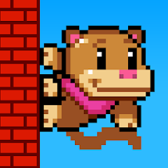
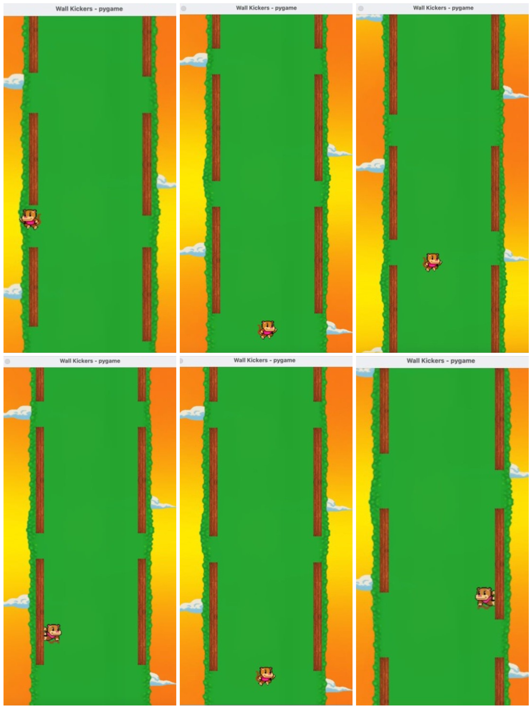

  

<h1 align="center">Wall Kickers Clone 🐵🚀</h1>

  

  
  
  

  <a href="#english-farsi">English & فارسی</a> • <a href="#russian">Русский</a>

---

## 🇬🇧 🇮🇷 English Description & Persian Translation

### ✨ Features (ویژگی‌ها)

- 🍕 **Auto-Bounce Mechanics:** Character bounces automatically; you only handle the direction! (مکانیک پرش خودکار: کاراکتر به صورت خودکار می‌پرد؛ شما فقط جهت را کنترل می‌کنید!)
- 🍥 **Procedural Level Design:** Infinite and dynamic wall generation with safe vertical gaps. (طراحی مرحله پویا: تولید بی‌نهایت و خودکار دیوارها با فواصل عمودی ایمن و محاسبه‌شده.)
- 🍔 **State-Machine Animations:** Fluidly shifts sprites between standing, jumping, and wall-hanging. (انیمیشن‌های وضعیت‌محور: تغییر نرم تصاویر میمون بین حالت‌های ایستاده، پرش و آویزان به دیوار.)
- 🍟 **Performance Optimized:** Off-screen objects are automatically destroyed to save CPU/Memory. (بهینه‌سازی عملکرد: حذف خودکار اشیاء خارج از صفحه برای کاهش مصرف پردازنده و حافظه.)
- 🌭 **Smart Camera:** Smooth vertical camera that follows the player's progression upward. (دوربین هوشمند: حرکت عمودی و نرم دوربین همگام با صعود بازیکن به سمت بالا.)

### 🌴 Download & Run (دانلود و اجرا)

1. **Clone the repository (کلون کردن مخزن):**
   
bash
   git clone [https://github.com/FarzadSeparo/Wall-Kickers.git](https://github.com/FarzadSeparo/Wall-Kickers.git)
   cd Wall-Kickers

 2. **Install Pygame (نصب پای‌گیم):**
   
bash
   pip install pygame
   
  
 3. **Launch the game (اجرای بازی):**
   
bash
   python main.py
   
   

 

 
### 🇷🇺 Описание на русском языке (Russian Description)

### ✨ Особенности
 * 🍕 Механика автопрыжка: Персонаж прыгает автоматически; вы управляете только направлением!
 * 🍥 Процедурный дизайн уровней: Бесконечная и динамическая генерация стен с безопасными, просчитанными вертикальными промежутками.
 * 🍔 Анимация на основе состояний: Плавное переключение спрайтов между состояниями стояния, прыжка и зависания на стене.
 * 🍟 Оптимизация производительности: Объекты за пределами экрана автоматически удаляются для экономии ресурсов процессора и памяти.
 * 🌭 Умная камера: Плавная вертикальная камера, которая следует за продвижением игрока вверх.
 * 
### 🌴 Скачать и запустить
 1. Клонировать репозиторий:
  
   git clone [https://github.com/FarzadSeparo/Wall-Kickers.git](https://github.com/FarzadSeparo/Wall-Kickers.git)
   cd Wall-Kickers
   
   
 2. Установить Pygame:
  
   pip install pygame
   
   
 3. Запустить игру:
  
   python main.py

  

### 🎨 Screenshots (تصاویر بازی / Скриншоты)

### 📄 License
This project is licensed under the MIT License - see the LICENSE file for details.
